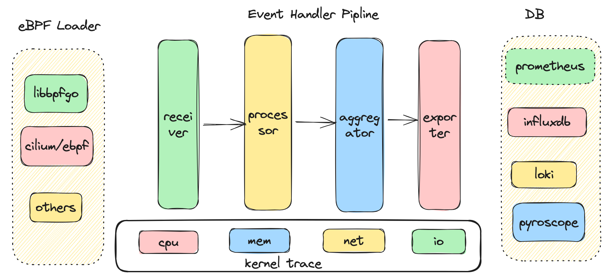

# spycat
An eBPF observable agent to solve os performance issue in kernel or app
## Architecture
<div align=center>  </div>

## Build & Run
### Build
```
make all
```
```
clang-14 -ggdb -gdwarf -O2 -Wall -fpie -Wno-unused-variable -Wno-unused-function -O2 -g -Wall -Werror  -I/home/ubuntu/code/spycat/pkg/ebpf/headers -target bpf -D__TARGET_ARCH_x86  -c /home/ubuntu/code/spycat/pkg/ebpf/cpu/offcpu/offcpu.bpf.c -o /home/ubuntu/code/spycat/pkg/ebpf/cpu/offcpu/offcpu.bpf.o
clang-14 -ggdb -gdwarf -O2 -Wall -fpie -Wno-unused-variable -Wno-unused-function -O2 -g -Wall -Werror  -I/home/ubuntu/code/spycat/pkg/ebpf/headers -target bpf -D__TARGET_ARCH_x86  -c /home/ubuntu/code/spycat/pkg/ebpf/cpu/oncpu/oncpu.bpf.c -o /home/ubuntu/code/spycat/pkg/ebpf/cpu/oncpu/oncpu.bpf.o
go build spycat
CGO_CFLAGS="-I/home/ubuntu/code/spycat/lib/libbpf/lib/include -I/home/ubuntu/code/spycat/lib/bcc/lib/include/bcc_syms" \
CGO_LDFLAGS="-L/home/ubuntu/code/spycat/lib/libbpf/lib/lib64 -lbpf -L/home/ubuntu/code/spycat/lib/bcc/lib/lib -lbcc-syms -lstdc++ -lelf -lz" \
go build -ldflags "-linkmode external -extldflags '-static' -X 'main.version=main_5d35ae2' \
-X 'main.commitId=5d35ae2' -X 'main.releaseTime=2024-03-04T15:50:13Z' \
-X 'main.goVersion=go version go1.20.13 linux/amd64' -X 'main.author=dylane'" -o spycat /home/ubuntu/code/spycat/cmd/spycat/main.go 
# command-line-arguments
/usr/bin/ld: /tmp/go-link-4015527396/000024.o: in function `_cgo_cbcce81e6342_C2func_getaddrinfo':
cgo_unix_cgo.cgo2.c:(.text+0x8d): warning: Using 'getaddrinfo' in statically linked applications requires at runtime the shared libraries from the glibc version used for linking
```
### Run
## License
spycat is distributed under [Apache License, Version2.0]
## Thanks
* Kindling Pyroscope libbpf bcc
* ...
